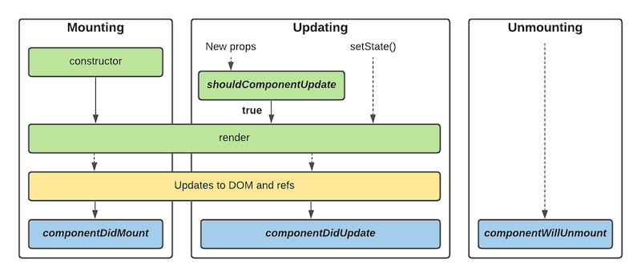
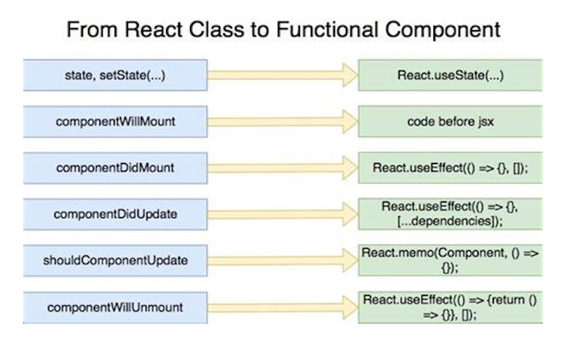

<!---
marp: true
theme: uncover
class: invert
headingDivider: 2
paginate: true
header: 
footer: 'Created with [Marp](https://marp.app) and [Github Pages](https://pages.github.com)'
backgroundImage: url('img/react-logo.svg')
backgroundPosition: 120% 120%
backgroundSize: 40%
style: |
  section,
  section code {
    font-size: 30px;
    text-align: left;
  }

  section ul,
  section ol,
  section img {
    margin-left: 0;
  }

  section.long p,
  section.long ul,
  section.long ol,
  section.long code, {
    font-size: 24px;
  }

  section .columns img {
    width: 100%;
  }

  section .columns {
    display: grid;
    grid-template-columns: repeat(2, minmax(0, 1fr));
    gap: 1rem;
  }

  section marp-pre code {

  }

  section header img {
    height: 100px;
    width: 100px;
    float: right;
  }
--->

# React Workshop

State, lifecycle and hooks

# Introduction

- State is a data store for our components
  - It can be used make decisions on how the UI is rendered
  - It can be used display interactive content in our UI
- Components have lifecycles
  - These are mounting, updating and unmounting
- Components have ways for us to perform operations at certain stages of this lifecycle
  - In functional components we can use hooks
  - In class based components we have lifecycle methods

# The React 16.8 caveat

- Pre React 16.8, functional components cannot easily hook into the lifecycle
- Instead we have to use class components
- Post React 16.8 we can use something called "hooks" to hook into the lifecycle
- Hooks are not analagous to class based lifecycle methods but can be used to perform similar operations

# Component Lifecycle

- React components have a lifecycle with 3 phases:
- Mounting - triggered on creation of component and insertion into the DOM
- Updating - triggered when a component's props or state change
- Unmounting - triggered before the component is removed from the DOM

# Class Component lifecycle



# Hooks Component lifecycle



# Class based lifecycle methods

- In class based components, each phase has a number of methods to hook into lifecycle events
- Each lifecycle method is general purpose
- We can chose to run actions at each point in the lifecycle by using the correct method
- We can use lifecycle methods to modify state, perform side effects and cleanup

```jsx
class MyComponent extends React.Component{
  componentDidMount () {
    // do something when the components mounts
  }

  ...
}
```

# Hooks

- In functional components we can use hooks to "hook" into a component lifecycle
- Some hooks are specialised for a particular task
- Some hooks are more general purpose
- We can use built in hooks from React core, custom hooks and third party hooks to perform specific tasks
- Hooks always begin with `use`

```jsx
function MyComponent (props) {
  useEffect(function () {
    // Do something after render
  }, []);

  ...
}
```

# So what is the story arc?

- There is an arc to how we build our components:
- Create a simple component which renders a static UI
- Add state to store data
- Add side effects to do things like fetch data
- Cleaning up side effects
- Add events to trigger data changes on the server and the client
- Increase complexity of how data is modified
- Share data with other components


# Adding state to store data

# Setting up state in functional components

- We use the `useState` hook to get the state value and the state setter
- We initialise the state by passing the initial state to `useState(initialState)`

```jsx
function UserComponent (props) {
  const [user, setUser] = React.useState({});

  return <UserForm user={user} />;
}
```

# Setting up state in class components

- We initialise our state in the `constructor`

```jsx
class UserComponent extends React.Component {
  constructor (props) {
    super(props);
    this.state = {};
  }

  render () {
    return <UserForm user={this.state} />;
  }
}
```

# Add side effects to do things like fetch data

- Side effects are anything which sits outside the scope of React
- This includes things like making HTTP requests, using local storage, setting up timers
- Let's assume we have a function which fetches a user from the API like so:

```jsx
function fetchUser (userId) {
  return fetch(`http://localhost:3000/users/${userId}`, {
    method: 'GET'
  }).then(function (response) {
    return response.json();
  })
}
```

# Side effects in functional components

<div class="columns">

- We can use `useEffect` to handle side effects
- Takes a function which performs the side effect
- Takes an array of dependent values which, if changed, will re trigger on render
- If the array is empty it will trigger once after first render
- If no array is provided it will trigger on every render

```jsx
function UserComponent (props) {
  const [user, setUser] = React.useState({});

  function fetchUserAndUpdateState () {
    fetchUser(props.userId).then(setUser);
  }

  // runs when props.userId changes
  React.useEffect(fetchUserAndUpdateState, [props.userId]);

  // Runs only on first render
  // React.useEffect(fetchUserAndUpdateState, []);

  // Runs every render
  // React.useEffect(fetchUserAndUpdateState);

  return <UserForm user={user} />;
}
```

</div>

# Side effects in class components

<div class="columns">

- We can use `componentDidMount` to fetch data
- `componentDidMount` is called after the first render
- this means components can render with initial state at first
- We can use `componentWillUnmount` to cleanup before unmounting

```jsx
class UserComponent extends React.Component {
  constructor (props) {
    super(props);
    this.state = {};
  }

  componentDidMount () {
    fetchUser(this.props.userId).then(user => this.setState(user));
  }

  render () {
    return <UserForm user={this.state} />;
  }
}
```

# Cleaning up side effects

- So we started making a request
- What happens if the user navigates away and the component is unmounted?
- The request continues anyway. This is wasteful!
- We should cleanup after ourselves
- By modifying our `fetchUser` function we can control our request

```jsx
function fetchUser (userId, controller=null) {
  return fetch(`http://localhost:3000/users/${userId}`, {
    method: 'GET',
    signal: (controller) ? controller.signal : null
  }).then(function (response) {
    return response.json();
  })
}
```


# Cleaning up side effects in functional components

<div class="columns">

- `useEffect` allows us to cleanup side effects before the component is unmounted
- We can do this by returning another function from our side effect function
- Let's take an example of cancelling a request if the user navigates away

```jsx
function UserComponent (props) {
  const [user, setUser] = React.useState({});

  function fetchUserAndUpdateState () {
    const controller = new AbortController();
    fetchUser(props.userId, controller).then(setUser);
    return controller.abort;
  }

  React.useEffect(fetchUserAndUpdateState, [props.userId]);

  return <UserForm user={user} />;
}
```

</div>

# Cleaning up side effects in class components

<div class="columns">

- We can use `componentDidMount` to fetch data
- `componentDidMount` is called after the first render
- this means components can render with initial state at first
- We can use `componentWillUnmount` to cleanup before unmounting

```jsx
class UserComponent extends React.Component {
  constructor (props) {
    super(props);
    this.state = {};
    this.controller = new AbortController();
  }

  componentDidMount () {
    fetchUser(this.props.userId, controller)
      .then(user => this.setUser(user));
  }

  componentWillUnmount () {
    this.controller.abort();
  }

  render () {
    return <UserForm user={this.state} />;
  }
}
```

</div>

# Add events to trigger data changes on the server and the client

- We can use events to trigger updates on the server
- Once the server has completed updating, we can update our state
- Similarly to the `fetchUser` function we can create a function for updating users

```jsx
function updateUser (userId, userData) {
  return fetch(`http://localhost:3000/users/${userId}`, {
    method: 'PUT',
    body: JSON.stringify(userData)
  }).then(function (response) {
    return response.json();
  })
}
```

# Updating the server and the state in a functional component

```jsx
function UserComponent (props) {
  const [user, setUser] = React.useState({});

  function handleUpdate (userData) {
    updateUser(props.userId, userData).then(setUser);
  }

  return <UserForm onSubmit={handleUpdate} user={user} />;
}
```

# Updating the server and the state in class components

```jsx
class UserComponent extends React.Component {
  constructor (props) {
    super(props);
    this.state = {};
    // Note how we bind this to handleUpdate
    this.handleUpdate = this.handleUpdate.bind(this);
  }

  handleUpdate (userData) {
    updateUser(this.props.userId, userData).then(user => this.setState(user));
  }

  render () {
    return <UserForm onSubmit={this.handleUpdate} user={this.state} />;
  }
}
```

# Break
# Increase complexity of how data is modified

- Sometimes state management gets complex
- We want to decouple state management logic from event handlers
- We may need to do some complex setting of the state when something changes
- We can do this using something called reducers
- In older versions of React we had no reducers
- Insted in old react we used Redux to manage state which "connects" components
- In new versions we can use reducers with functional components

# What is a reducer

- A reducer is a function which returns a new, modified state
- It takes the original state as an argument
- It takes an action which tells us how to modify the state
- Actions are objects
- Actions contain a type (the name of the action)
- Actions contain data about the change we want to make

```js
function userReducer (state = {}, action) {
  switch (action.type) {
    case 'update_user':
      return Object.assign({}, state, action.payload);
    default:
      return state;
  }
}
```

# Modifying complex state changes in functional components using `useReducer`

<!--- _class: long invert --->

<div class="columns">

- Modern React has a hook for modifying state in a reducer
- It's less complex than redux
- `useReducer` is an abstraction of `useState`
- `useReducer` takes a reducer function
- `useReducer` takes the initial state
- `useReducer` returns the state and a function `dispatch`
- `dispatch` functions "dispatch" an action to our reducer
- state lives at the component level


```jsx
function UserComponent (props) {
  const [user, dispatch] = React.useReducer(userReducer, {});

  function setUser (userData) {
    dispatch({ type: 'update_user', payload: userData });
  }

  function handleUpdate (userData) {
    updateUser(props.userId, userData).then(setUser);
  }

  return <UserForm onSubmit={handleUpdate} user={user} />;
}
```

</div>


# Modifying complex state changes class components using Redux

<div class="columns">

- We must use react-redux to `connect` components to redux
- "Connected" components are referred to as containers
- Redux helps us decouple state from a component
- We can map our current state to the component props
- We can also map `dispatch` functions to props
- `dispatch` functions "dispatch" an action to our reducer
- state lives at the qpplication level

```jsx
import { connect } from 'react-redux';

class UserComponent extends React.Component {
  constructor(props) {
    super(props)
    this.handleUpdate = this.handleUpdate.bind(this);
  }

  handleUpdate (userData) {
    updateUser(this.props.userId, userData)
      .then(user => this.props.updateUser(user));
  }

  render () {
    return <UserForm onSubmit={handleUpdate} user={this.props.user} />;
  }
}

function mapStateToProps (state) {
  const user = state.user;
  return { user: user };
};

function mapDispatchToProps (dispatch) {
  return {
    updateUser: function (userData) {
      dispatch({ type: 'update_user', payload: userData })
    }
  }
};

const UserContainer = connect(
  mapStateToProps,
  mapDispatchToProps
)(UsersComponent);
```

<!---
Notice how the component has no state now, only props. essentially arguments instead of internal state
--->

</div>

# Share data with other components

- In simple applications we can share data with child components using prop drilling
- Prop drilling passes down from parent to child to where it is required
- With deeply nested components, prop drilling can become cumbersome
- Perhaps we need some kind of "global" state

# `useContext` in functional components

<div class="columns">

- `useContext` allows us to share state from high up in the component tree to somewhere much lower
- It makes child components less dependent on widely shared state
- It can be more brittle than prop drilling

```jsx
const UserContext = React.createContext();

function CurrentlyLoggedInUser (props) {
  const user = React.useContext(UserContext);
  return <p>Logged in as {user.username}</p>;
}

function Navigation () {
  return <nav><LoggedInUser /></nav>;
}

function App (props) {
  const user = { username: "Andy" };

  return (
    <UsernameContext.Provider value={user}>
      <Navigation />
    </UsernameContext.Provider>
  );
}
```

</div>

# Global variables in class components

- We dont really have a way to do this!
- Honestly, you don't really need it
- You can use Redux instead as a global state store

# The truth about `useContext`

- Beware, "global" variables are bad
- Using component composition and `props.children` you can often get around it


# Custom hooks

<div class="columns">

- Lots of hooks to perform common tasks can make our components big and hard to read
- Imagine if every page required setting up state, fetching data from an API, updating the data etc
- What if we could do it all in one neat package


```jsx
function useRestfulApi (resourceName, resourceId, initialState) {
  const [resource, setResource] = React.useState(initialState);
  const url = `https://example.com/${resourceName}/${resourceId}`

  React.useEffect(function () {
    const controller = new AbortController();

    fetch(url, {
      method: 'GET'
    }).then(function (response) {
      return response.json();
    }).then(setResource);

    return controller.abort();
  }, [resourceId]);

  function updateResource (resourceData) {
    fetch(`http://localhost:3000/users/${props.userId}`, {
      method: 'PUT'
      body: JSON.stringify(resourceData)
    }).then(function (response) {
      return response.json();
    }).then(setResource);
  }

  return {
    resource: resource,
    updateResource: updateResource
  }
}

function UserComponent (props) {
  const [resource, updateResource] = useApi("user", props.userId, {});

  return <UserForm onChange={updateResource} user={resource} />
}
```

</div>

# Other hooks

- There are a number of built in hooks available for common use cases
- <https://beta.reactjs.org/reference/react>
- There are also a lot of external libraries
- <https://usehooks.com>
- <https://usehooks-ts.com>
- We can also build our own custom hooks
